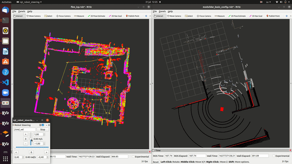
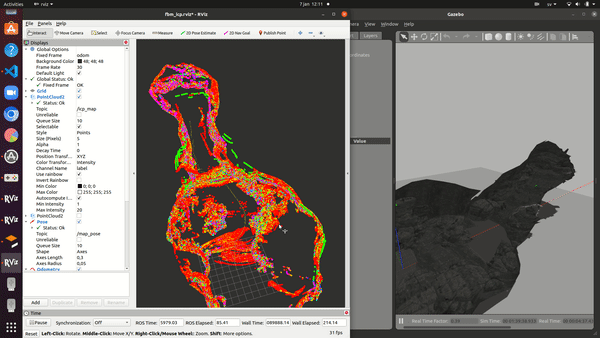
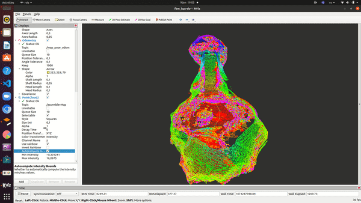
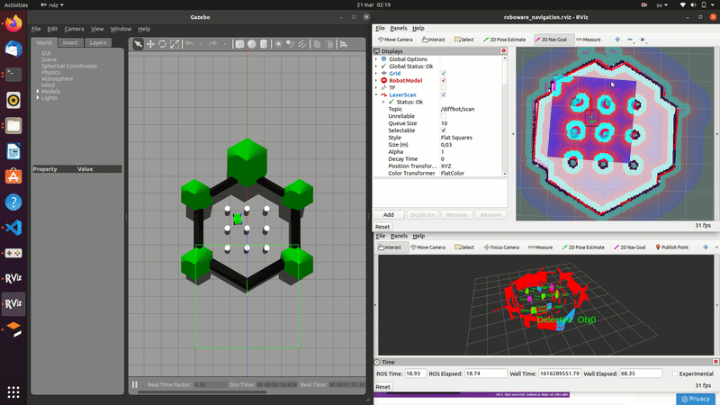
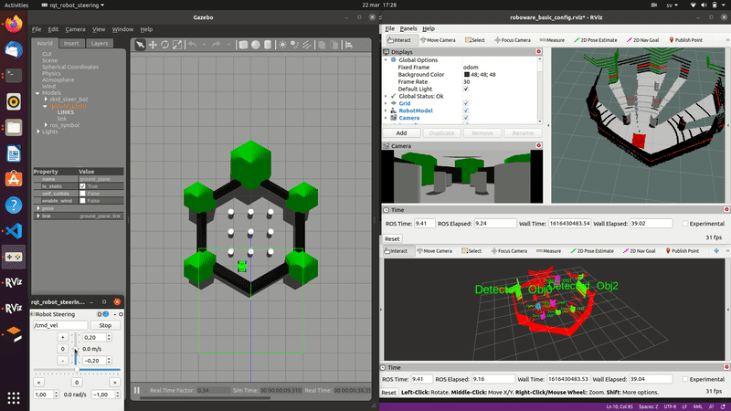

# Sigmapilot
Sigmpilot is an online demo for Sigma embedded engineering clients representing our skills in autonomous robotics, sensor fusion and simulation environments.
Sigmapilot is an all-in-one open-source software for autonomous UGVs and industrial robots. the target industries that Sigmapilot is working on are farming industry, mining industry, warehouses industry, and construction industry. 

we were always wondering why there isnt any framework that processes robust autonomous software stack on **Raspberry Pi** board that can be used in UGV industries, do we always need a **NVIDIA** board?. The result was **Sigmapilot** :)

# Sigmapilot Featues

- Modular software components can work with different sensors(benwake/velodyne)
- 3D semantic segmentaiton object detection.
- Freespace estimation.
- Integration of Sigmapilot with ROS packages such as gmapping, move base, and amcl.
- Free space fusion for cocoon Setup.
- 3D point cloud assembly.
- 3D mapping and matching.
- Camera-LiDAR fusion.

# Sigmapilot Planned Features

- Object tracking.
- new approaches for 2D mapping and matching.

# Demos:

## Feature Based Mapping
### Run
launch the **sigmapilot_gazebo.launch** file then the **fbm_icp.launch** files in two different terminals.
     
     roslaunch gazebo_simulator sigmapilot_gazebo.launch
     roslaunch feature_based_mapping fbm_icp.launch
### Loop closure
in the below demo we present a loop closure of the FBM algorithm, where there is no deviation of the constructed map

### Elivated Environments
in the below demo we present the algorithm estimates in elevated environments, such as elevated caves

in the below demo we present the qualitative validation of the accumlative map(Ground truth), and the generated FBM point cloud. 

## Navigation
### Sigmapilot Farm simulation demo Velodyne 

    roslaunch gazebo_simulator robot_navigation.launch sensor:=velodyne world_name:='$(find gazebo_simulator)/worlds/turtlebot3_world.world' map_file:='$(find gazebo_simulator)/maps/map.yaml'

### Sigmapilot Cave simulation demo velodyne

    roslaunch gazebo_simulator robot_navigation.launch sensor:=velodyne world_name:='$(find gazebo_simulator)/worlds/50m_long_mine_world.world' map_file:='$(find gazebo_simulator)/maps/mymap_cave.yaml'

### Sigmapilot Farm simulation demo Benwake cocoon

    roslaunch gazebo_simulator robot_navigation.launch sensor:=benwake world_name:='$(find gazebo_simulator)/worlds/turtlebot3_world.world' map_file:='$(find gazebo_simulator)/maps/map.yaml'

## SLAM

### Sigmapilot map farm environment

    roslaunch gazebo_simulator Sigmapilot_gazebo.launch sensor:=velodyne

### Sigmapilot map cave environment

    roslaunch gazebo_simulator Sigmapilot_gazebo.launch sensor:=velodyne world_name:='$(find gazebo_simulator)/worlds/50m_long_mine_world.world' 

## Raspberry pi benchmarking

 follow the instructions in [sgm_lidar_clustering](sgm_lidar_clustering/README.md)

## SGM clustering Vs lidar_euclidean_cluster_detect

 read the benchmarking section in [sgm_lidar_clustering](sgm_lidar_clustering/README.md)

## Contact us
khalid.elmadawi@sigma.se
