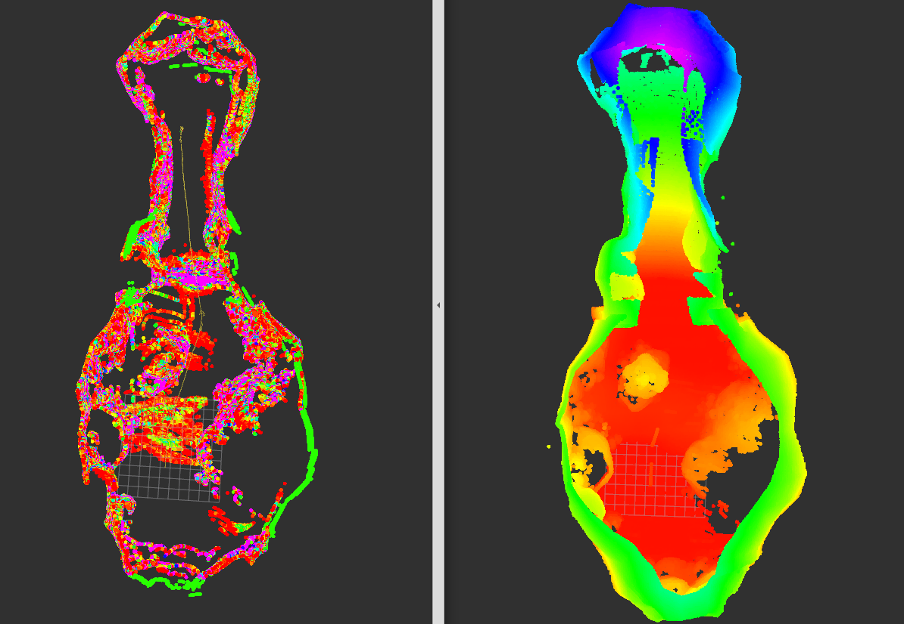
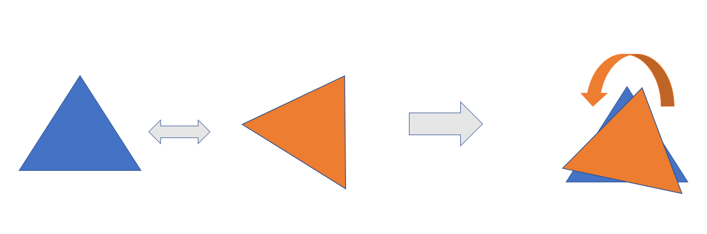
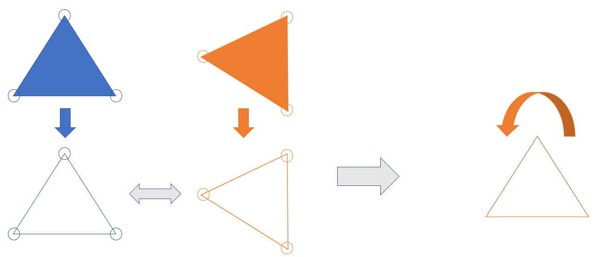

# Feature Based Map
feature based mapping is a new approach of 3D slam where it use only key points in surrounding environment to localize and construct a map of the surrounding environment, which make our constructed map 

    1) more accurate, immune from redundant data and noise from the surrounding environment.
    2) faster and more computative efficient.

## Run
launch the **sigmapilot_gazebo.launch** file then the **fbm_icp.launch** files in two different terminals.
     
     roslaunch gazebo_simulator sigmapilot_gazebo.launch
     roslaunch feature_based_mapping fbm_icp.launch
## Demo
### Loop closure
in the below demo we present a loop closure of the FBM algorithm, where there is no deviation of the constructed map

### Elivated Environments
in the below demo we present the algorithm estimates in elevated environments, such as elevated caves

in the below demo we present the qualitative validation of the accumlative map(Ground truth), and the generated FBM point cloud. 

## Module Features
### High periority features:
------------------------
 - [x] Estimate XYZRPY localization.
 - [x] Loop closure 
 - [x] construct scalable map.
 - [x] validate the output map with the assmebler map qualitatively.
 - [x] initial position.(load parameter from lunch file)
 - [x] fuse IMU with point cloud. 
 - [x] test on cave environment.(elevated environment)
 - [x] cropbox filter.
 - [ ] filter the accumilated map with a threshold to find the dominant key points.
 - [ ] save map.
 - [ ] fix the z localization estimate. 

### Low periority features:
------------------------
    1)[ ]Dense maps.
    2)[ ]test on rpi.

## Explaination
### Motivation
if we have a two scattered pointclouds in a shape of a triangle, and we want to match these two point clouds with each other, we might not get an accurate translation and rotation resulting a non accurate matching, one of the main reasons for that is redundancy of data results in false statistical representations, which requires huge computation to fix.

the proposed solution is to extract the keypoints from each point cloud and match them together, by that the statistical error will be reduced to the minimum, resulting an outstanding results.

### Algorithm Steps
    1) ponint cloud encoding in spherical grid map.
    2) feature extraction of the slopes diffrentiation.
    3) encode the keypoints in XYZRGB
    4) downsample the point cloud
    5) use imu rotation to get a better rotation estimate.
    6) translate and rotate the current point cloud with the previous location.
    7) calculate the translation and rotaiton with the old map
    8) update the localization of the vehicle.
    9) combine the two pointclouds.
    10) downsample the combined pointcloud again.
    11) publish the constructed map.
