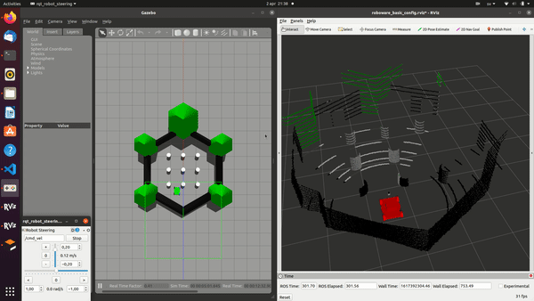

## gazebo_ros_quadcopter_lidar_plugin
---
This repo is a custome plugin to simulate light weight LiDARs for Quadcopter mapping and object detection for different sensors, with different mounting positions, to see the best configuration for your solution/system.
# Features
- [x] Publish Pointcloud msg.
- [x] Fuse Camera with LiDAR point cloud.
- [x] Translate and rotate the fused point cloud in case SDF is used.
- [x] Can use multiple sensors in the same robot.
- [x] tf publish.
- [ ] range lockup table processing.

**TODO:**
- Max-Min range lock-up table processing.

# Build
    catkin build gazebo_ros_lidar_plugin 

# SDF configuration:
you can find how to configure your LiDAR in the SDF file in **SDF_config** folder, where you can find **benwakeCE30** and **velodyne 16**, and you can extend your specs based on these two examples.

