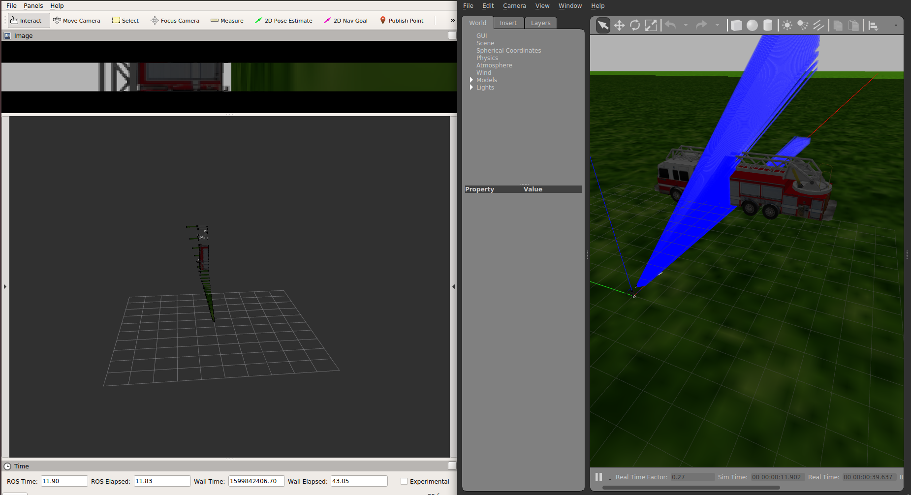
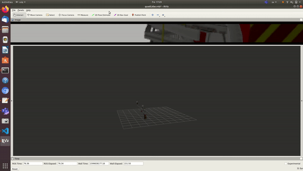

## Benwake CE30 SDF Configuration
---
**Sensor Specs**
- Method: Time of flight
- Peak Wave Length: 850nm
- FoV: 60*4 degrees
- Pixel Resolution: 320*20
- Angular Resolution (vertical):  0.2 degree
- Frame Rate: 30fps
- Ranging Resolution: 1cm
- Detecting Range: 0.4~30m@90% reflectivity
- Repeatability (1σ): ≤5cm
- Accuracy: ≤15cm
- Ambient Light Resistance: 60klux
- Data Interface: UDP
- Operating Temperature: 0-50
- Supply Voltage: DC 12V ± 0.5V（≥3A）
- Power Consumption: ≤8W
- Enclosure Rating: IP65
- Weight: 334g
---
**SDF Sensor configuration**

we will configure a camera and a lidar sensor sensors in the lidar link

**Camera Sensor Configuration**

- camera horizontal FOV same horizontal FOV of the LiDAR sensor.
- camera image width is the same number of points per layer in LiDAR sensor.
- camera has same x-pixel size, and y-pixel size, where the size of the pixel = (horizontal FOV/image width).
- camera image height is set by (LidAR vertical FOV/pixel size) + some safety pixels.
- camera rate and range are the same LiDAR rate and range.
- camera frame name is the same LiDAR frame name.
- make it easy don't add distortion.

        <sensor name="camera" type="camera">
          <pose>0.2 0 0.3 1.57 0 0</pose>
          <camera>
            <horizontal_fov>1.0472</horizontal_fov>
            <image>
              <width>320</width>
              <height>20</height>
            </image>
            <clip>
              <near>0.05</near>
              <far>100</far>
            </clip>
          </camera>
          <always_on>1</always_on>
          <update_rate>30</update_rate>
          <visualize>true</visualize>

          <!--  <plugin name="irlock" filename="libArduCopterIRLockPlugin.so">
              <fiducial>irlock_beacon_01</fiducial>
          </plugin> -->
          <plugin name="camera_controller" filename="libgazebo_ros_camera.so">
            <alwaysOn>true</alwaysOn>
            <updateRate>0.0</updateRate>
            <cameraName>webcam</cameraName>
            <imageTopicName>QuadCopterLiDAR_image_raw</imageTopicName>
            <cameraInfoTopicName>camera_info</cameraInfoTopicName>
            <frameName>QuadCopterLiDAR_link</frameName>
            <hackBaseline>0.07</hackBaseline>
            <distortionK1>0.0</distortionK1>
            <distortionK2>0.0</distortionK2>
            <distortionK3>0.0</distortionK3>
            <distortionT1>0.0</distortionT1>
            <distortionT2>0.0</distortionT2>
          </plugin>
        </sensor>

**Benwake CE30 Sensor Configuration**

- Simulate full horizontal FOV.
- Each layer has 320 points.
- sensor has 20 vertical layers.
- sensor range is 30m.
- If you are representing model in SDF then set the < pose > variable, else if xacro file then the tf msg will be published.
- Set < cam_fov > as the same fov set in camera.
- Camera fov might be slightly more than the LiDAR fov as a safety factor.
- Set < sensorId >.

        <sensor type="ray" name="laser">
          <pose>0.2 0 0.3 1.57 0 0</pose>
          <visualize>true</visualize>
          <update_rate>30</update_rate>
          <ray>
            <scan>
              <horizontal>
                <samples>320</samples>
                <resolution>1</resolution>
                <min_angle>-0.523599</min_angle>
                <max_angle>0.523599</max_angle>
              </horizontal>
              <vertical>
                <samples>20</samples>
                <resolution>1</resolution>
                <min_angle>-0.0349066</min_angle>
                <max_angle>0.0349066</max_angle>
              </vertical>
            </scan>
            <range>
              <min>0.4</min>
              <max>30</max>
              <resolution>0.1</resolution>
            </range>
            <!-- <noise>
                <type>Gaussian</type>
                <mean>0.0</mean>
                <stddev>0.01</stddev>
              </noise> -->
          </ray>
          <plugin name="QuadCopterLiDAR_node" filename="libgazebo_ros_quadcopter_lidar_plugin.so">
            <robotNamespace></robotNamespace>
            <topicName>/spur/laser/scan</topicName>
            <frameName>/QuadCopterLiDAR_link</frameName>
            <sensorId>1</sensorId>
            <pose>0.2 0 0.3 1.57 0 0</pose>
            <cam_fov>1.0472</cam_fov>
            <cam_topic_name>/webcam/QuadCopterLiDAR_image_raw</cam_topic_name>
          </plugin>
        </sensor>

Images below shows Benwake perception as the Quadcopter hover around a fire truck.

