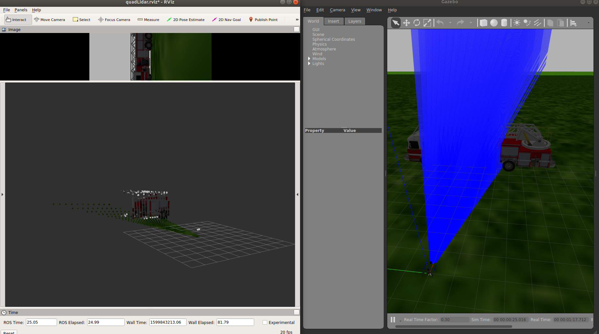
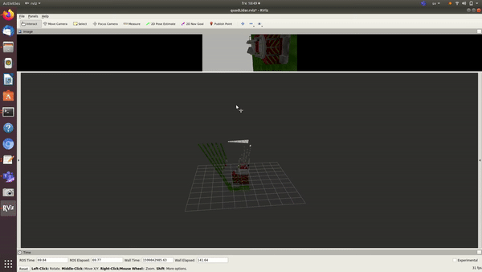

## Velodyne 16 lite pack SDF Configuration
---
**Sensor Specs**
- Time of flight distance measurement with calibrated reflectivities
- 16 channels 
- Measurement range up to 100 meters
- Accuracy: +/- 3 cm (typical)
- Dual returns
- Field of view (vertical): 30° (+15° to -15°)
- Angular resolution (vertical): 2°
- Field of view (horizontal/azimuth): 360°
- Angular resolution (horizontal/azimuth): 0.1° - 0.4°
- Rotation rate: 5 - 20 Hz 
- Integrated web server for easy monitoring and configuration
---
**SDF Sensor configuration**

we will configure a camera and a lidar sensor sensors in the lidar link

**Camera Sensor Configuration**

- camera horizontal FOV same horizontal FOV of the LiDAR sensor.
- camera image width is the same number of points per layer in LiDAR sensor.
- camera has same x-pixel size, and y-pixel size, where the size of the pixel = (horizontal FOV/image width).
- camera image height is set by (LidAR vertical FOV/pixel size) + some safety pixels.
- camera rate and range are the same LiDAR rate and range.
- camera frame name is the same LiDAR frame name.
- make it easy don't add distortion.

        <sensor name="camera" type="camera">
          <pose>0.2 0 0.3 1.57 0 0</pose>
          <camera>
            <horizontal_fov>1.59</horizontal_fov>
            <image>
              <width>512</width><!--512 because we have 512 scan point per layer -->
              <height>200</height><!-- 200 because pixel size in -->
            </image>
            <clip>
              <near>0.05</near>
              <far>100</far>
            </clip>
          </camera>
          <always_on>1</always_on>
          <update_rate>10</update_rate>
          <visualize>false</visualize>

          <!--  <plugin name="irlock" filename="libArduCopterIRLockPlugin.so">
              <fiducial>irlock_beacon_01</fiducial>
          </plugin> -->
          <plugin name="camera_controller" filename="libgazebo_ros_camera.so">
            <alwaysOn>true</alwaysOn>
            <updateRate>0.0</updateRate>
            <cameraName>webcam</cameraName>
            <imageTopicName>QuadCopterLiDAR_image_raw</imageTopicName>
            <cameraInfoTopicName>camera_info</cameraInfoTopicName>
            <frameName>QuadCopterLiDAR_link</frameName>
            <hackBaseline>0.07</hackBaseline>
            <distortionK1>0.0</distortionK1>
            <distortionK2>0.0</distortionK2>
            <distortionK3>0.0</distortionK3>
            <distortionT1>0.0</distortionT1>
            <distortionT2>0.0</distortionT2>
          </plugin>

        </sensor>

**Velodyne 16 Sensor Configuration**

- Simulate 90 degree of Veldoyne horizontal FOV to reduce simulation processing.
- each layer has 2048 points, 90 degrees contains 512.
- sensor has 16 vertical layers.
- sensor range is 100m.
- If you are representing model in SDF then set the < pose > variable, else if xacro file then the tf msg will be published.
- Set < cam_fov > as the same fov set in camera.
- Camera fov might be slightly more than the LiDAR fov as a safety factor.
- Set < sensorId >.

        <sensor type="ray" name="laser">
          <pose>0.2 0 0.3 1.57 0 0</pose>
          <visualize>true</visualize>
          <update_rate>10</update_rate>
          <ray>
            <scan>
              <horizontal>
                <samples>512</samples>
                <resolution>1</resolution>
                <min_angle>-0.785398</min_angle>
                <max_angle>0.785398</max_angle>
              </horizontal>
              <vertical>
                <samples>16</samples>
                <resolution>1</resolution>
                <min_angle>-0.261799</min_angle>
                <max_angle>0.261799</max_angle>
              </vertical>
            </scan>
            <range>
              <min>0.1</min>
              <max>100</max>
              <resolution>0.1</resolution>
            </range>
            <!-- <noise>
                <type>Gaussian</type>
                <mean>0.0</mean>
                <stddev>0.01</stddev>
              </noise> -->
          </ray>
          <plugin name="QuadCopterLiDAR_node" filename="libgazebo_ros_quadcopter_lidar_plugin.so">
            <robotNamespace></robotNamespace>
            <topicName>/spur/laser/scan</topicName>
            <frameName>/QuadCopterLiDAR_link</frameName>
            <sensorId>1</sensorId>
            <pose>0.2 0 0.3 1.57 0 0</pose>
            <cam_fov>1.59</cam_fov>
            <cam_topic_name>/webcam/QuadCopterLiDAR_image_raw</cam_topic_name>
          </plugin>
        </sensor>
        
Images below shows Benwake perception as the Quadcopter hover around a fire truck.

